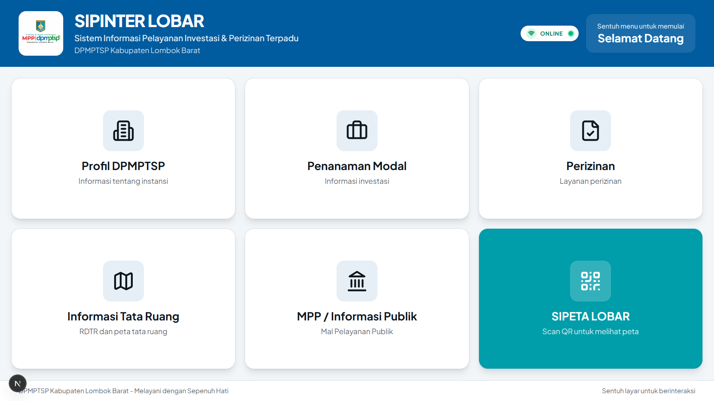

# SIPINTER LOBAR (Sistem Informasi Pelayanan Investasi & Perizinan Terpadu)



**SIPINTER LOBAR** adalah aplikasi Kiosk (Anjungan Mandiri) berbasis layar sentuh yang dikembangkan untuk **Dinas Penanaman Modal dan Pelayanan Terpadu Satu Pintu (DPMPTSP) Kabupaten Lombok Barat**.

Aplikasi ini dirancang khusus untuk dijalankan pada layar **TV Touchscreen 65 inci**, berfungsi sebagai pusat informasi publik digital yang interaktif untuk memudahkan masyarakat mengakses informasi investasi, perizinan, dan tata ruang.

## 🌟 Fitur Utama

* **📺 65-Inch Touchscreen Optimized**: Antarmuka pengguna (UI) dirancang dengan tombol besar, tipografi jelas, dan layout yang mudah dijangkau (*accessibility-first*) untuk layar besar.
* **📱 Smart Grid Layout**: Sistem tata letak cerdas yang secara otomatis menyesuaikan ukuran kartu menu (*Submenu Card*) agar selalu memenuhi layar secara estetis, baik saat menu sedikit maupun banyak.
* **📄 Integrated PDF Viewer**: Membuka dokumen (SOP, Regulasi, IPRO) langsung di dalam aplikasi tanpa perlu berpindah halaman atau membuka tab browser baru.
* **🎥 Video Player Integration**: Pemutar video profil dan layanan yang tertanam langsung.
* **🗺️ Tata Ruang & Peta Digital**: Integrasi QR Code untuk akses cepat ke peta RDTR Interaktif dan SIPETA (Potensi Investasi) via smartphone.
* **🏛️ Direktori Layanan MPP**: Informasi lengkap mengenai instansi dan jenis layanan yang tersedia di Mal Pelayanan Publik (MPP).

## 📋 Daftar Menu & Fungsionalitas

Aplikasi ini dibagi menjadi dua antarmuka utama berdasarkan penggunanya:

### 1. 👤 Menu Pengguna (Kiosk Public Mode)
Antarmuka utama yang diakses oleh masyarakat umum melalui layar sentuh.

* **🏢 Profil DPMPTSP**: Menampilkan Visi Misi, Struktur Organisasi, Profil Pejabat, Tugas & Fungsi, serta Video Profil Instansi.
* **💼 Penanaman Modal**: Informasi peluang investasi (IPRO) dan Laporan Kegiatan Penanaman Modal (LKPM).
* **📝 Perizinan**: Direktori Standar Operasional Prosedur (SOP), Standar Pelayanan (SP), dan daftar layanan perizinan berdasarkan sektor.
* **🗺️ Tata Ruang**: Akses ke dokumen RDTR (Rencana Detail Tata Ruang) dan Peta RTRW Interaktif (via QR Code).
* **🏛️ Mal Pelayanan Publik (MPP)**: Daftar instansi yang tergabung dalam MPP, jenis layanan, persyaratan, alur, dan maklumat pelayanan.
* **📍 SIPETA LOBAR**: Fitur integrasi QR Code untuk membuka peta potensi investasi di smartphone pengguna.

### 2. 🛡️ Menu Admin (Dashboard Pengelola)
Halaman khusus (terproteksi) untuk admin/petugas DPMPTSP mengelola konten aplikasi.

* **📊 Dashboard**: Ringkasan status sistem.
* **📝 Manajemen Konten**: Mengedit teks profil, visi misi, dan informasi layanan tanpa mengubah kode program.
* **📂 Manajemen Dokumen**: Mengunggah dan memperbarui file PDF (SOP, Regulasi, Dokumen IPRO) yang tampil di aplikasi.
* **🎥 Pengaturan Media**: Mengganti video profil atau banner yang ditampilkan pada halaman utama.

## 🛠️ Teknologi yang Digunakan

Aplikasi ini dibangun menggunakan teknologi web modern untuk menjamin performa tinggi dan kemudahan pengembangan:

* **[Next.js 14/15](https://nextjs.org/)** - Framework React utama (App Router).
* **[TypeScript](https://www.typescriptlang.org/)** - Untuk keamanan tipe data dan kode yang lebih rapi.
* **[Tailwind CSS](https://tailwindcss.com/)** - Styling utility-first untuk desain responsif cepat.
* **[Shadcn UI](https://ui.shadcn.com/)** - Komponen UI yang reusable dan aksesibel.
* **[Lucide React](https://lucide.dev/)** - Ikonografi modern dan konsisten.
* **React PDF** - Render dokumen PDF sisi klien.

## 📂 Struktur Proyek

Berikut adalah struktur folder utama aplikasi Kiosk ini:

```bash
SIPINTER-LOBAR/
├── app/
│   └── page.tsx               # Entry point aplikasi
├── components/
│   ├── kiosk/                 # Komponen inti Kiosk
│   │   ├── kiosk-app.tsx      # Main Logic & Router
│   │   ├── home-screen.tsx    # Tampilan Awal
│   │   ├── submenu-screen.tsx # Tampilan Menu Level 2 (Smart Grid)
│   │   ├── content-screen.tsx # Tampilan Detail (Teks/QR)
│   │   ├── sectors-screen.tsx # Grid Layanan Sektor
│   │   └── navigation-bar.tsx # Header Navigasi Konsisten
│   └── ui/                    # Komponen Shadcn (Button, Card, dll)
├── lib/
│   ├── kiosk-data.tsx         # Database statis (Menu, Konten, Struktur)
│   └── utils.ts               # Helper functions
└── public/                    # Aset gambar, PDF, dan Video